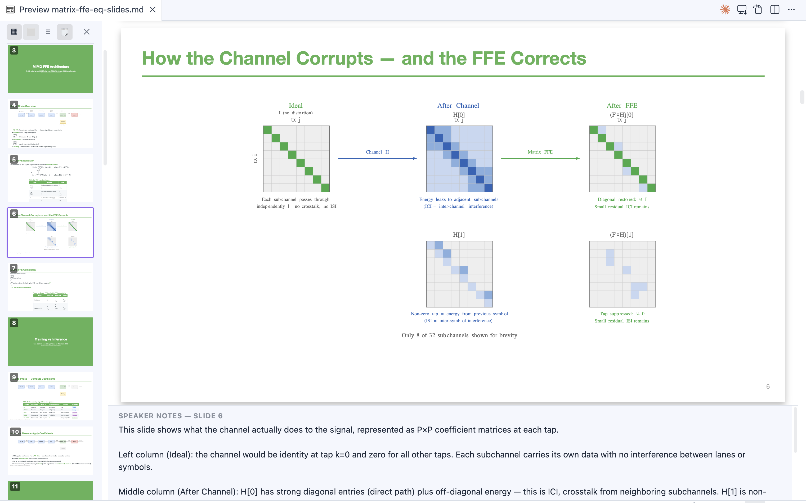
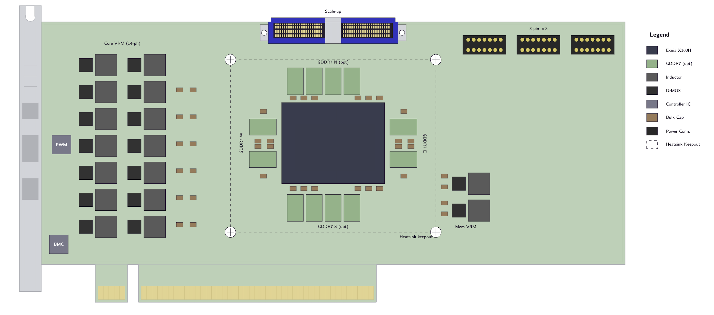
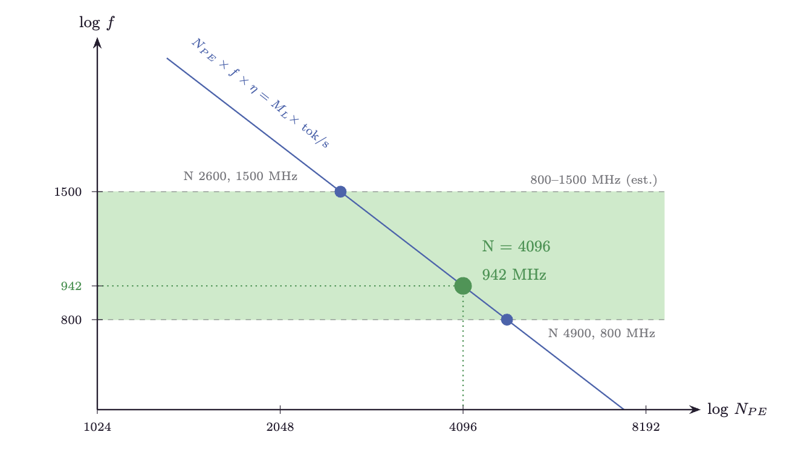
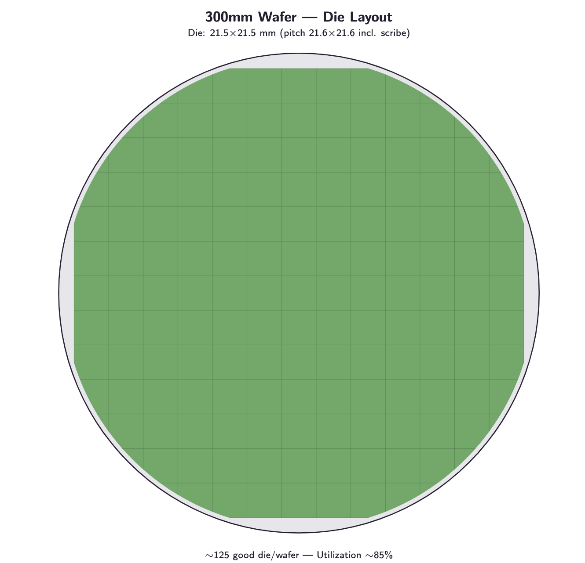
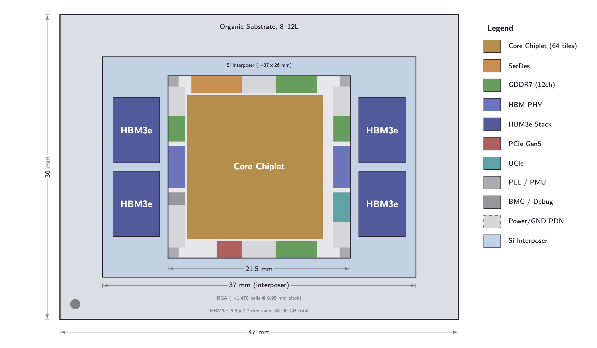

# TikZJax for VS Code

[](https://marketplace.visualstudio.com/items?itemName=kevinyuan.vscode-tikzjax)
[](https://marketplace.visualstudio.com/items?itemName=kevinyuan.vscode-tikzjax)

Render precise and beautiful TikZ diagrams directly in your Markdown files. Create mathematical diagrams, circuit schematics, chemical structures, commutative diagrams, and more — all with live preview. Works with both standard Markdown preview and [Marp](https://marp.app/) slide decks, with one-click export to **editable PPTX**.

For Marp presentations, the extension also provides a **Slide Navigator** with thumbnail sidebar and a **speaker notes panel** — features not available in the standard Marp VS Code extension.

## Gallery

<table>
<tr>
<td align="center"><em>TikZ diagrams in Marp slides with one-click PPTX export</em></td>
</tr>
<tr>
<td align="center"></td>
</tr>
</table>

<table>
<tr>
<td align="center"><em>PCIe board layout</em></td>
</tr>
<tr>
<td align="center"></td>
</tr>
</table>

<table>
<tr>
<td align="center"><em>Log-log trade-off chart</em></td>
<td align="center"><em>Wafer die layout</em></td>
<td align="center"><em>Package floorplan</em></td>
</tr>
<tr>
<td align="center"></td>
<td align="center"></td>
<td align="center"></td>
</tr>
</table>

More TikZ diagram examples can be found in this article: [Decoding the Taalas HC1 — A Quantitative Analysis](https://kevinyuan1.substack.com/p/decoding-the-taalas-hc1-a-quantitative)

## Features

- **Live Preview**: See your TikZ diagrams rendered in real-time as you type
- **Marp Compatibility**: TikZ diagrams render inside Marp slide decks (`marp: true`), export to **editable PPTX**
- **Slide Navigator** ✦: Thumbnail sidebar with three view modes (small/large thumbnails, outline) and click-to-navigate — synced with the main slide view
- **Speaker Notes Panel** ✦: Live speaker notes extracted from Marp HTML comments, displayed alongside the slide preview
- **Rich Package Support**: Use chemfig, circuitikz, pgfplots, tikz-cd, and more
- **Dark Mode**: Automatic color inversion for seamless dark theme integration
- **External File Include**: Reference TikZ files with `%!include` — keep Markdown clean, edit diagrams separately
- **Smart Caching**: Previously rendered diagrams load instantly
- **Error Handling**: Clear error messages with retry options
- **Syntax Highlighting**: LaTeX syntax highlighting in tikz code blocks

## Quick Start

1. Create or open a Markdown file in VS Code
2. Add a tikz code block:

````markdown
```tikz
\begin{document}
\begin{tikzpicture}
  \draw[thick, ->] (0,0) -- (2,0) node[right] {$x$};
  \draw[thick, ->] (0,0) -- (0,2) node[above] {$y$};
  \draw[blue, thick] (0,0) circle (1);
\end{tikzpicture}
\end{document}
```
````

3. Open the Markdown preview (`Ctrl+Shift+V` / `Cmd+Shift+V`)
4. Your diagram appears in the preview panel!

## Marp Slide Decks

TikZ diagrams work inside [Marp](https://marketplace.visualstudio.com/items?itemName=marp-team.marp-vscode) slide decks. Add `marp: true` to your frontmatter and use tikz code blocks as usual:

````markdown
---
marp: true
---

# My Presentation

```tikz
\begin{document}
\begin{tikzpicture}
  \node[circle, draw] (a) at (0,0) {A};
  \node[circle, draw] (b) at (3,0) {B};
  \draw[->] (a) -- (b);
\end{tikzpicture}
\end{document}
```
````

### Diagram sizing in Marp

Marp renders slides at a fixed 1280x720 resolution, then scales the entire slide to fit the preview pane. This means TikZ diagrams may appear smaller than in standard Markdown preview, since they occupy a smaller proportion of the 1280px-wide slide.

To make diagrams larger in Marp slides, use TikZ's `scale` option:

````markdown
```tikz
\begin{document}
\begin{tikzpicture}[scale=2]
  \draw (0,0) rectangle (3,2);
  \node at (1.5,1) {\Large Hello!};
\end{tikzpicture}
\end{document}
```
````

A `scale=2` factor generally makes diagrams appear at a similar visual size to the standard Markdown preview.

## Usage

### Basic TikZ Diagram

Create geometric shapes and drawings:

````markdown
```tikz
\begin{document}
\begin{tikzpicture}
  % Rectangle
  \draw[thick] (0,0) rectangle (2,1.5);

  % Circle
  \draw[fill=blue!20] (4,0.75) circle (0.75);

  % Triangle
  \draw[fill=red!20] (6,0) -- (7.5,0) -- (6.75,1.5) -- cycle;
\end{tikzpicture}
\end{document}
```
````

### Graph with Nodes

````markdown
```tikz
\begin{document}
\begin{tikzpicture}[node distance=2cm]
  \node[circle,draw] (A) {A};
  \node[circle,draw] (B) [right of=A] {B};
  \node[circle,draw] (C) [below of=A] {C};
  \node[circle,draw] (D) [right of=C] {D};

  \draw[->] (A) -- (B);
  \draw[->] (A) -- (C);
  \draw[->] (B) -- (D);
  \draw[->] (C) -- (D);
\end{tikzpicture}
\end{document}
```
````

## Supported Packages

The extension supports a wide range of LaTeX packages for specialized diagrams:

### Chemistry - chemfig

Draw chemical structures and molecules:

````markdown
```tikz
\usepackage{chemfig}
\begin{document}
\chemfig{H_3C-CH_2-OH}
\end{document}
```
````

### Circuits - circuitikz

Create electronic circuit diagrams:

````markdown
```tikz
\usepackage{circuitikz}
\begin{document}
\begin{circuitikz}
  \draw (0,0) to[battery1, l=$V$] (0,3)
        to[R=$R_1$] (3,3)
        to[R=$R_2$] (3,0)
        -- (0,0);
\end{circuitikz}
\end{document}
```
````

### Plots - pgfplots

Plot mathematical functions and data:

````markdown
```tikz
\usepackage{pgfplots}
\pgfplotsset{compat=1.18}
\begin{document}
\begin{tikzpicture}
  \begin{axis}[
    xlabel=$x$,
    ylabel=$y$,
    domain=-2:2,
    samples=100
  ]
    \addplot[blue, thick] {x^2};
    \addplot[red, thick] {x^3};
  \end{axis}
\end{tikzpicture}
\end{document}
```
````

### Commutative Diagrams - tikz-cd

Create category theory diagrams:

````markdown
```tikz
\usepackage{tikz-cd}
\begin{document}
\begin{tikzcd}
  A \arrow[r, "f"] \arrow[d, "g"] & B \arrow[d, "h"] \\
  C \arrow[r, "k"] & D
\end{tikzcd}
\end{document}
```
````

### 3D Diagrams - tikz-3dplot

Draw three-dimensional figures:

````markdown
```tikz
\usepackage{tikz-3dplot}
\begin{document}
\tdplotsetmaincoords{60}{110}
\begin{tikzpicture}[tdplot_main_coords]
  \draw[thick,->] (0,0,0) -- (3,0,0) node[anchor=north east]{$x$};
  \draw[thick,->] (0,0,0) -- (0,3,0) node[anchor=north west]{$y$};
  \draw[thick,->] (0,0,0) -- (0,0,3) node[anchor=south]{$z$};
\end{tikzpicture}
\end{document}
```
````

### Mathematics - amsmath, amstext, amsfonts, amssymb

Full support for advanced mathematical notation and symbols.

### Arrays - array

Create complex array and table structures within diagrams.

## Commands

Access these commands via the Command Palette (`Ctrl+Shift+P` / `Cmd+Shift+P`):

| Command | Description |
|---------|-------------|
| **TikZ: Open TikZ Preview** | Open the preview panel to see rendered diagrams |
| **TikZ: Refresh TikZ Diagrams** | Re-render all diagrams in the current document |
| **TikZ: Clear TikZ Cache** | Clear cached diagrams and force fresh rendering |
| **TikZ: Reset TikZJax Engine** | Reset the rendering engine (useful after errors) |
| **TikZ: Toggle Slide Thumbnails** | Show/hide the slide thumbnail sidebar in Marp preview |
| **TikZ: Export Marp Slides to PPTX** | Export the current Marp deck to editable PPTX |
| **TikZ: Toggle Speaker Notes Export** | Toggle whether speaker notes are included in PPTX export |

All commands are available when editing Markdown files.

## Configuration

Customize the extension behavior through VS Code settings:

### `tikzjax.marpPptxNotes`

**Type:** `boolean`
**Default:** `true`

Include speaker notes (HTML comments `<!-- ... -->`) when exporting Marp slides to PPTX. When enabled, notes appear in the PowerPoint notes pane for each slide. Toggle quickly with the **TikZ: Toggle Speaker Notes Export** command.

```json
{
  "tikzjax.marpPptxNotes": true
}
```

### `tikzjax.invertColorsInDarkMode`

**Type:** `boolean`
**Default:** `true`

Automatically invert diagram colors when using a dark theme. Black colors become the current text color, and white colors match the background.

```json
{
  "tikzjax.invertColorsInDarkMode": true
}
```

### `tikzjax.renderTimeout`

**Type:** `number` (milliseconds)
**Default:** `15000`
**Range:** 1000 - 60000

Maximum time to wait for a diagram to render before timing out. Increase this for complex diagrams.

```json
{
  "tikzjax.renderTimeout": 20000
}
```

### `tikzjax.autoPreview`

**Type:** `boolean`
**Default:** `false`

Automatically open the preview panel when opening a Markdown file containing TikZ diagrams.

```json
{
  "tikzjax.autoPreview": true
}
```

### `tikzjax.previewPosition`

**Type:** `"side" | "below" | "window"`
**Default:** `"side"`

Default position for the preview panel:
- `"side"`: Open beside the editor (recommended)
- `"below"`: Open below the editor
- `"window"`: Open in a separate window

```json
{
  "tikzjax.previewPosition": "side"
}
```

## Marp Slide Navigator

When previewing a Marp slide deck, a slide navigator appears in the preview pane:

- **Thumbnail sidebar**: Click the hamburger button (top-left) to open. Thumbnails stay synced with your scroll position.
- **Three view modes**: Switch between small thumbnails, large thumbnails, and outline view using the toolbar icons.
- **Speaker notes**: Toggle the notes panel from the toolbar to see speaker notes for the current slide. Notes are extracted from HTML comments in your Markdown (`<!-- Your notes here -->`). Use **TikZ: Toggle Speaker Notes Export** to control whether notes are included in PPTX export.
- **Click to navigate**: Click any thumbnail or outline item to smoothly scroll to that slide.
- **Command palette**: Use `TikZ: Toggle Slide Thumbnails` to toggle the sidebar.

## Export Marp Slides to Editable PPTX

For Marp slide decks containing TikZ diagrams, you can export directly to **editable PPTX** from VS Code. When a Marp file is open (`marp: true` in frontmatter), an export button appears in the editor title bar — visible in both the editor and preview modes.

Click the button to:
1. Render all TikZ diagrams to SVG
2. Run `marp-cli` with `--pptx-editable` to produce an editable `.pptx` file
3. Post-process the PPTX to inject native math objects and fix layout
4. Save the output next to the source file (timestamped)

The exported PPTX contains editable text and shapes — not just images. CSS backgrounds, images, and colored slide backgrounds are preserved. The export shows progress in a notification with cancel support, and offers "Open File" / "Reveal in Finder" actions on completion.

### Math Formula Support in PPTX

LaTeX math formulas (`$...$` inline and `$$...$$` display) in Marp slides are converted to **native PowerPoint math objects** (OMML) — not images. This means formulas are fully editable in PowerPoint and render crisply at any zoom level.

- **Display math** (`$$...$$`) is centered and automatically given sufficient vertical space
- **Inline math** spacing with `\quad`, `\qquad` is preserved
- **Bold/italic math** (`\mathbf`, `\mathit`) uses native PowerPoint bold/italic styling
- **Accents** (`\hat`, `\tilde`, `\vec`, etc.) render correctly using combining diacritics
- **N-ary operators** (`\sum`, `\prod`, `\int`, etc.) with limits render as native PowerPoint nary elements

> **Prerequisites**: Install [marp-cli](https://github.com/marp-team/marp-cli) (`npm install -g @marp-team/marp-cli`) and [LibreOffice](https://www.libreoffice.org/) (required for editable PPTX conversion).

### CLI Export

You can also export from the command line using the bundled `marp-tikz.js` script:

```bash
node marp-tikz.js slides.md -- --pptx --allow-local-files --html
node marp-tikz.js slides.md -- --pdf --allow-local-files --html
```

## External File Include

Keep your Markdown clean by storing TikZ diagrams in separate `.tikz` files. Use the `%!include` directive to reference them:

````markdown
```tikz
%!include diagrams/circuit.tikz
```
````

The included file should contain complete TikZ code (with `\begin{document}` / `\end{document}`):

```latex
% diagrams/circuit.tikz
\usepackage{circuitikz}
\begin{document}
\begin{circuitikz}
  \draw (0,0) to[battery1, l=$V$] (0,3)
        to[R=$R_1$] (3,3)
        to[R=$R_2$] (3,0)
        -- (0,0);
\end{circuitikz}
\end{document}
```

- **Relative paths** are resolved from the Markdown file's directory
- **Absolute paths** are also supported
- **Auto-refresh**: The preview updates automatically when you edit and save the included file
- **Per-file caching**: Unchanged files are not re-read or re-rendered

This is especially useful for AI-assisted workflows — each diagram can be maintained independently in its own file.

## Tips and Tricks

### Multiple Diagrams

You can include multiple tikz code blocks in a single Markdown file. Each diagram renders independently.

### Error Handling

If a diagram fails to render, the extension displays an error message inline. Common issues:

- **Syntax errors**: Check your LaTeX syntax
- **Missing packages**: Ensure you've included the correct `\usepackage{}` statement
- **Timeout**: Increase `tikzjax.renderTimeout` for complex diagrams

Use the **Retry** button or **Reset TikZJax Engine** command to recover from errors.

### Performance

- **Caching**: Rendered diagrams are cached automatically. Unchanged diagrams load instantly.
- **Incremental Updates**: Only modified diagrams are re-rendered when you edit.
- **Clear Cache**: Use the **Clear TikZ Cache** command if you need to force re-rendering.

### Dark Mode

The extension automatically adjusts diagram colors for dark themes. If you prefer original colors, disable this feature:

```json
{
  "tikzjax.invertColorsInDarkMode": false
}
```

## Troubleshooting

### Diagrams not rendering

1. Ensure you're editing a Markdown file (`.md` extension)
2. Check that your code block uses the `tikz` language identifier
3. Open the Markdown preview (`Ctrl+Shift+V` / `Cmd+Shift+V`)
4. Check the error message if displayed

### Slow rendering

1. Increase the timeout: `"tikzjax.renderTimeout": 30000`
2. Simplify complex diagrams
3. Use the cache — unchanged diagrams load instantly

### Preview not updating

1. Use **TikZJax: Refresh TikZ Diagrams** to force an update
2. Try **TikZJax: Reset TikZJax Engine** if issues persist
3. Close and reopen the preview panel

### Colors look wrong in dark mode

1. Toggle `tikzjax.invertColorsInDarkMode` setting
2. Use explicit colors in your diagrams if needed
3. Refresh the preview after changing themes

## Requirements

- VS Code 1.85.0 or higher
- No internet connection required — rendering is fully offline
- **For editable PPTX export** (optional):
  - [marp-cli](https://github.com/marp-team/marp-cli) v4.1.0+ (`npm install -g @marp-team/marp-cli`)
  - [LibreOffice](https://www.libreoffice.org/) (used by marp-cli for ODP→PPTX conversion)

## License

MIT License - see [LICENSE.md](LICENSE.md) for details.

## Acknowledgments

- **[node-tikzjax](https://github.com/drgrice1/node-tikzjax)** by @drgrice1 - Server-side TikZ rendering engine
- **[obsidian-tikzjax](https://github.com/artisticat1/obsidian-tikzjax)** by @artisticat1 - Original Obsidian plugin
- **[TikZJax](https://github.com/kisonecat/tikzjax)** by @kisonecat - Browser-based TikZ compiler

---

**Enjoy creating beautiful diagrams!** If you encounter issues or have suggestions, please [file an issue on GitHub](https://github.com/kevinyuan/vscode-tikz/issues).
